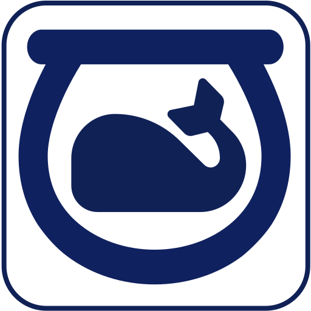

# Fishbowl

Desktop app/gadget for monitoring containers and general system performance

## The Project

This started as a sidebar on getting more from [Sysinternals BGInfo](https://github.com/houstonhaynes/SysInternals-BGInfo-boilerplate). I had cobbled together some VBScripted queries to get Hyper V info - basically CPU updates from individual container instances. But I wanted to have more informaton in a lighter framework (BGInfo re-writes the entire background image in update which is like fixing a pocket watch with a sledgehammer). While I'm imagining this *eventually* being a background service that can feed a UI anywhere on the network - and therefore keeping that burden *off* of the local system - I'm starting with a relatively straightforward applet/widget/gadget approach.

## Tech Stack

The idea here is to write this app/widget in F# using a multi-targeting framework, such as Xamarin/MAUI, Uno and/or Avalonia. I've opted to start with Avalonia.FuncUI. It covers everything I need for desktop scaffolding, has good JetBrains Rider tooling and implements MVU and has Elmish bindings ready to go.

## Going Multi-Platform

While I plan to eventually make this available on MacOS and Linux, I'm focusing initially on WinOS. This is really a learning project for me, and using multi-targeting frameworks like AvaloniaUI, Uno and perhaps even MAUI is part of my long-term objective here. Similarly, I plan to have mobile apps that monitor the traffic on the targeted desktop, so Android and iOS is on the board - but I'm not sure which mobile-targeting framework I'm going to choose. But for now I'm focusing on a dedicated desktop experience, with WinOS up first.
